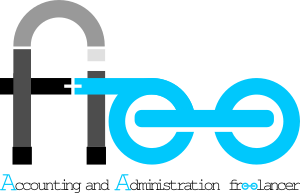

## About Laravacc AndAFree

Laravacc AndAFree is a web accounting application build with Laravel framework. Laravel is expressive & elegant syntax framework.

## Feature

-   [GL Legder](https://laravel.com/docs/routing).
-   [CRM](https://laravel.com/docs/container).
